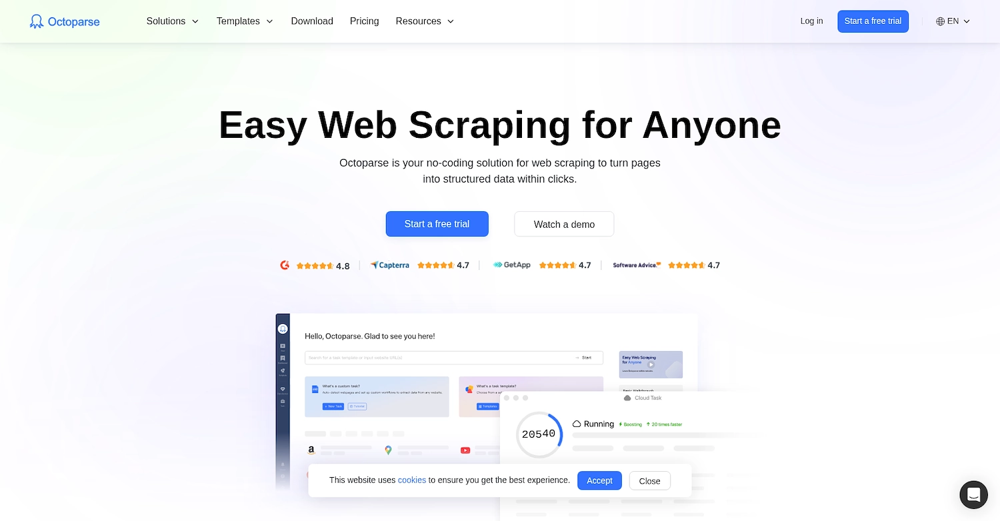
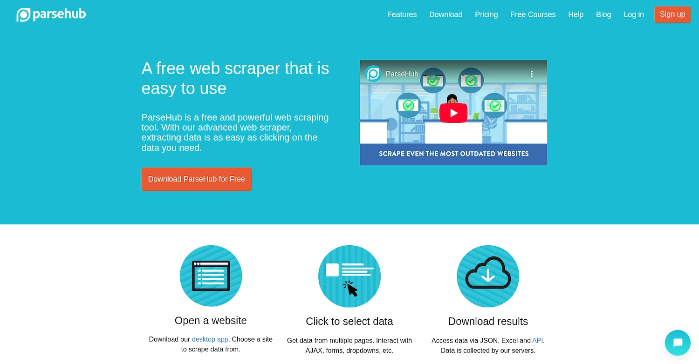
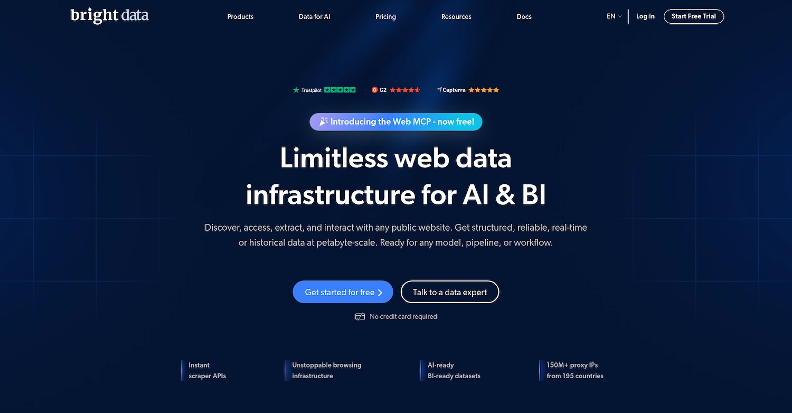
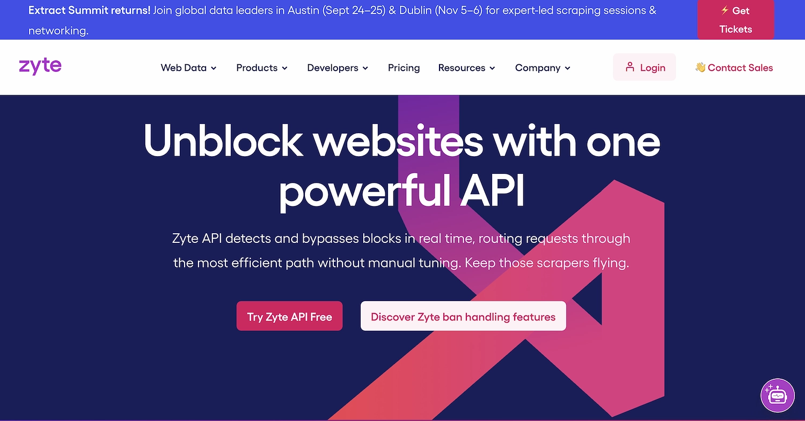
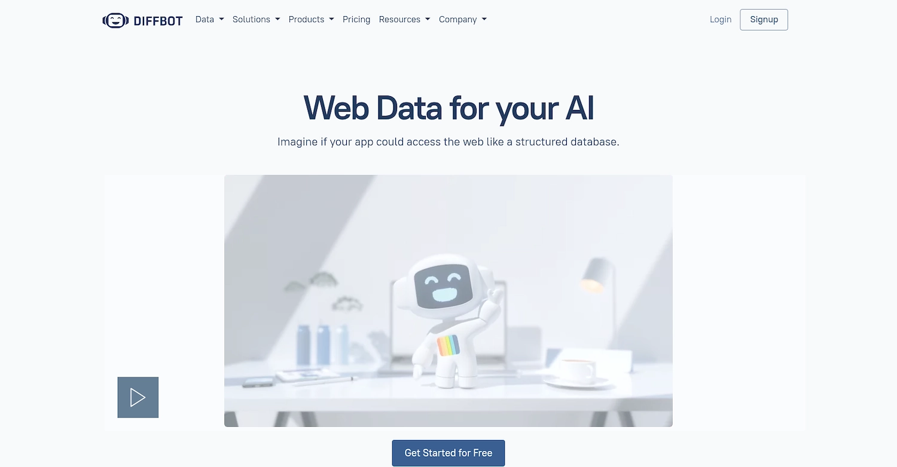
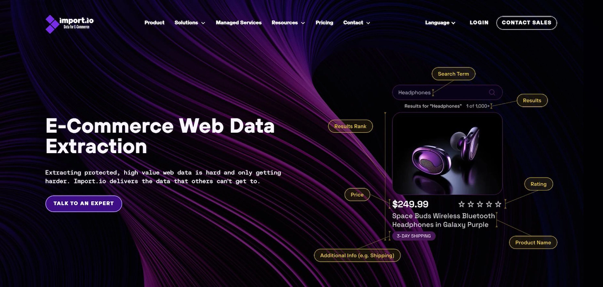
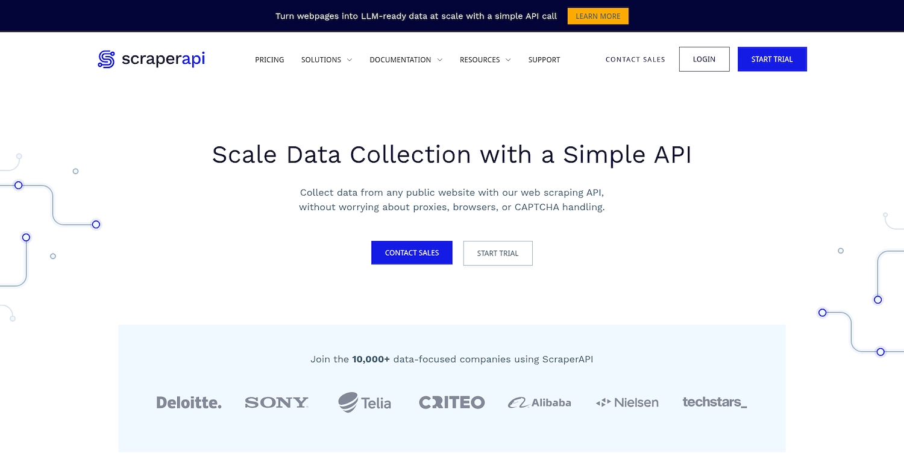
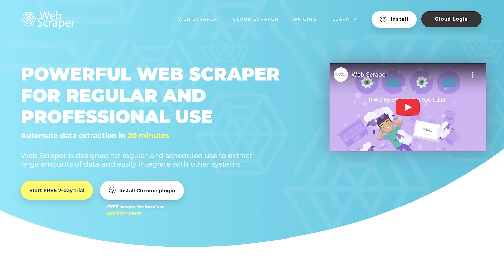
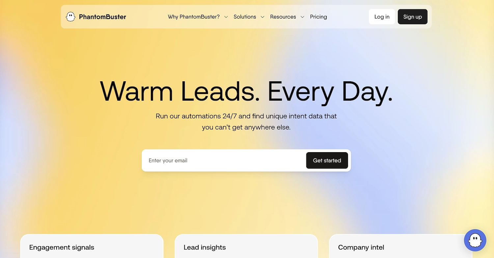

# Apify 替代方案：11 款工具对比，帮你找到最适合的选择

你是否在用 Apify 爬数据，却发现学习曲线陡峭、价格越用越贵？或者你只是想找个更简单的工具来搞定销售线索抓取?

这篇文章会带你看看市场上最值得考虑的 Apify 替代品。我们会聊聊每个工具的优缺点、适合什么场景、价格怎么算——让你能根据自己的实际需求做出选择。

---

## 先说说 Apify 是什么

[Apify](https://apify.com) 在开发者圈子里挺火的。它擅长两件事：一是让你自己搭建爬虫程序，二是提供无代码的数据采集功能。对于这两个场景，它确实做得不错。

但也有不少人反映，上手有点难，而且当你的数据量越来越大时，账单可能会让你头疼。所以我们整理了这份替代方案清单，帮你看看还有哪些选择。

## 如果你要做销售自动化，可以看看 11x

11x 提供的是 AI 数字员工，专门帮销售团队干活。这些"员工"能帮你找潜在客户、发邮件、更新 CRM——你的团队只需要专注谈单子就行。

👉 [想要既能采集数据又能直接跑销售流程？试试这个平台](https://www.scraperapi.com/?fp_ref=coupons)

具体来说，[11x](https://www.11x.ai/) 有两个 AI 员工：Alice 负责找人、发外联邮件和 LinkedIn 消息，还能帮你保持 CRM 数据是最新的；Julian 则负责筛选进来的线索、约会议。整个平台把好几个工具的功能整合在一起，你不用再单独买数据丰富工具、外联工具或邮箱预热服务。

---

## Apify 的 11 个替代方案

下面我们逐个看看这些工具。每个评测都会包括价格、核心功能，以及它和 Apify 的优劣对比。

### 1) Octoparse

[Octoparse](https://www.octoparse.com) 是一个无代码工具，能把网页变成结构化数据。你用拖拽的方式就能搭建爬虫，还有 AI 助手自动识别页面数据。不懂代码的团队也能用。

平台用云服务器跑任务，可以定时执行。你可以用它抓联系人名单做销售线索，也可以采集竞争对手的价格信息。

**核心功能：**

- 无代码的可视化界面，拖拽就能搭爬虫
- AI 助手自动检测页面数据，还会给你一些建议
- 内置反封禁工具包，包括 IP 轮换、验证码破解、代理支持
- 几百个现成模板，常见网站直接用

**和 Apify 比怎么样？**

G2 评分：[4.8/5 星](https://www.g2.com/products/octoparse)（52 条评价）

- Octoparse 的点击式界面对非技术人员更友好，Apify 更适合开发者
- 它有几百个预设模板，拿来就能用；Apify 通常需要更多配置
- AI 助手会自动识别数据，省去手动设置的麻烦——这点 Apify 需要你自己写规则
- 整体设计就是给不会编程的人用的；Apify 功能更强大但也更复杂，适合需要定制化方案的开发者

**Octoparse 的局限：**

- 灵活性不如 Apify。对于结构复杂的网站，无代码界面可能搞不定，这时候 Apify 的开发者平台就显出优势了
- 集成能力也更有限。和其他系统对接没 Apify 的 API 那么方便
- 处理大规模或复杂任务时速度会慢一些。Apify 是为重型工作负载设计的，更适合大量数据处理

**价格：**

Octoparse 采用固定套餐定价：免费版、119 美元/月的标准版、299 美元/月的专业版。对比 Apify 的按用量计费模式，Octoparse 的预算更可控，而 Apify 对小项目或偶尔用一次的情况可能更划算。

---

### 2) ParseHub

[ParseHub](https://www.parsehub.com) 也是一个可视化数据采集工具，不用写代码就能抓网页数据。适合做销售线索收集、价格监控、市场调研。它能导航网站、识别信息、然后输出结构化数据。

**核心功能：**

- 点击网页元素就能搭爬虫,完全不用写代码
- 能处理用 JavaScript、AJAX 或无限滚动的动态网站
- 可以从表单、下拉菜单、登录墙后面提取数据，只需在应用里录制操作

**和 Apify 比怎么样？**

G2 评分：[4.3/5 星](https://www.g2.com/products/parsehub)（10 条评价）

- ParseHub 的点击式界面比 Apify 的开发者平台更容易上手
- 处理动态网站（JavaScript、无限滚动）只需点击操作，不用像 Apify 那样写代码
- 从表单和登录区域提取数据只需录制动作，比 Apify 需要的脚本简单多了
- 整体是为不会编程的团队设计的；Apify 是给需要定制方案的开发者用的

**ParseHub 的局限：**

- 无代码方式限制了高级定制。Apify 允许开发者注入自定义 JavaScript 来处理复杂的网站交互或数据转换
- API 和 webhook 选项不如 Apify 丰富，自动化工作流的搭建会受限
- 不适合大规模并发爬取。Apify 专门为并行处理优化,能同时跑很多任务

**价格：**

ParseHub 提供免费计划，付费版从 189 美元/月（标准版）到 549 美元/月（专业版）。固定套餐比 Apify 的按用量计费更好预算。对于有持续采集需求的团队，ParseHub 的模式可能更容易控制成本。

---

### 3) Bright Data

[Bright Data](https://brightdata.com) 是一个网页数据平台，提供代理网络和数据采集工具来提取公开的网页数据。它有预先收集好的数据集，也有个爬虫 IDE 可以自己搭建。公司用它来做客户发现和大规模采集竞争对手数据。

**核心功能：**

- 提供代理网络来采集公开网页数据
- 有现成的数据集可以直接拿来用
- 包含一个网页爬虫 IDE 来搭建自定义爬虫

**和 Apify 比怎么样？**

G2 评分：[4.6/5 星](https://www.g2.com/products/bright-data)（248 条评价）

- Bright Data 有超过 7200 万个住宅 IP 的代理网络，绕过封禁的能力比 Apify 平台内的代理方案更强
- 提供预先收集好的数据集可以立即使用，不像 Apify 需要先搭建并运行爬虫
- 支持按城市、州、运营商精确定位地理位置，比 Apify 的代理配置更精细
- 强调 GDPR 和 CCPA 合规性，这方面比 Apify 的开发者工具更突出

**Bright Data 的局限：**

- 没有公开的社区爬虫市场。Apify 的 Actor 库提供现成方案,能加快项目进度
- 网页爬虫 IDE 对高度复杂的网站灵活性不够。Apify 允许开发者注入自定义 JavaScript 来处理独特的交互或数据转换
- 定价模式对个人开发者或小项目不太友好。一些用户可能觉得 Apify 的按用量计费对偶尔使用更划算

**价格：**

Bright Data 的定价比较复杂，对小用户可能比 Apify 的按用量计费更贵。具体价格建议访问 [Bright Data 官网](https://www.g2.com/products/bright-data)查询，因为定价模式会变化。

---

### 4) Zyte

[Zyte](https://www.zyte.com) 提供网页数据提取服务。公司提供爬取网站和收集数据的工具，支持商业智能和销售线索生成。团队评估 Zyte 主要是看中它的网页数据采集方式，特别是需要信息来做销售线索或市场分析的项目。

**核心功能：**

- 提供弹性云托管、监控和自动化，专为 Scrapy 爬虫设计
- 使用专利 AI 模型解析特定数据类型，如产品、文章、职位信息
- 实时检测封禁并自动重试、轮换代理
- 包含专门的法律合规框架来支持数据采集操作

**和 Apify 比怎么样？**

G2 评分：[4.3/5 星](https://www.g2.com/products/zyte)（89 条评价）

- Zyte 为 Scrapy（流行的开源框架）提供原生云托管和自动化。对 Scrapy 开发者来说很熟悉，而 Apify 用的是自己的 Actor 系统
- 平台包含专门的法律框架和内部团队来指导数据采集法律问题，这种合规支持不是 Apify 开发者平台的重点
- 使用 AI 模型自动解析产品或文章等特定数据类型，能减少手动设置；Apify 通常需要更多自定义代码来结构化提取的数据
- 提供托管数据服务，由他们的团队处理定制爬取项目。这和 Apify 不同——Apify 主要是个平台，让用户自己搭建和管理爬虫

**Zyte 的局限：**

- 没有社区爬虫的公开市场。Apify 的 Actor 库提供现成方案,能加快常见任务的开发
- 集成能力有时更有限，搭建自动化工作流比较困难。Apify 提供更全面的 API 来连接其他应用
- 一些用户反映在非常大的任务上性能会慢。Apify 的平台为并行处理而建,能处理大量并发任务

**价格：**

Zyte 提供按请求计费的 API 访问，托管数据服务从 450 美元/月起。固定套餐提供预算可控性，而 Apify 的按用量计费对小任务可能更经济，但大规模时成本不太好预测。

---

### 5) Diffbot

[Diffbot](https://www.diffbot.com) 用 AI 把非结构化的网页转成结构化数据。它的工具能自动提取数据,用于市场情报和销售线索发现。平台作为一个来源，提供来自全网的组织化信息，企业可以用它来构建知识图谱或给应用提供数据。

**核心功能：**

- 提供知识图谱，包含超过 2.46 亿个组织和 16 亿篇文章，可以构建数据流和丰富现有数据集
- 使用预设数据类型来提取组织、新闻、零售产品、事件等特定信息，包括收入或情感等字段
- 包含自然语言 API 来从原始文本中检测实体、关系和情感
- 有个 Crawl API 能把任何网站变成产品、文章或讨论的结构化数据集

**和 Apify 比怎么样？**

G2 评分：[4.9/5 星](https://www.g2.com/products/diffbot)（29 条评价）

- Diffbot 提供预建的知识图谱，包含数十亿个实体，是现成的数据库；Apify 需要用户从头开始搭建和填充自己的数据集
- 工具使用机器视觉和自然语言处理来自动结构化网页数据，而 Apify 的数据结构化通常需要更多手动设置和自定义脚本
- 它有 Diffbot 查询语言（DQL）来精确提取数据，这是一种专门的查询方法；Apify 的平台依赖其 Actor 系统和自定义代码来检索数据
- 这个平台会自动提取产品或文章等特定数据类型，能减少设置时间；在 Apify 里用户通常要在爬虫中手动定义这些数据结构

**Diffbot 的局限：**

- 没有社区爬虫的公开市场。Apify 的 Actor 库提供现成方案,能加快某些项目
- 平台依赖自动提取有时会限制对复杂爬取任务的控制。Apify 允许开发者注入自定义代码来处理独特的网站结构或数据格式
- 一些用户反映 Diffbot 查询语言（DQL）有学习曲线,可能让特定数据查询比 Apify 更难——在 Apify 里开发者可以用熟悉的 JavaScript 写自定义逻辑

**价格：**

Diffbot 提供固定套餐，从 299 美元/月起，为持续使用提供可预测的预算。这和 Apify 的按用量计费不同——Apify 的成本与资源消耗挂钩，对小项目或偶尔使用可能更经济。

---

### 6) Import.io

[Import.io](https://www.import.io) 为企业提供网页数据提取工具。它帮助从网站收集信息用于市场研究和销售线索生成。平台不用代码就能把网页变成结构化数据，是给需要网页数据做分析但缺乏技术资源的团队用的。

**核心功能：**

- 根据客户需求设计、搭建和维护定制提取器，包括问题解决
- 将结构化数据交付到任何云目的地或通过 API,提供服务将数据标准化为定义的字典
- 捕获特定数据类型，如产品详情、价格、库存水平、消费者评论
- 分配专门的客户成功代表提供支持，并提供定期报告和操作监控

**和 Apify 比怎么样？**

G2 评分：[2.3/5 星](https://www.g2.com/products/import-io-2017-12-19)（2 条评价）

- Import.io 提供托管服务，由他们的团队搭建和维护定制数据提取器。这和 Apify 不同——Apify 是个平台，让用户自己搭建方案
- 平台为每个客户提供专门的客户成功代表，比 Apify 的标准支持渠道更个性化
- 它有个点击式界面给非技术用户创建数据提取器。Apify 相比之下是开发者平台，类似任务通常需要代码
- 这个工具提供数据标准化服务来适配定义的字典。在 Apify 平台上，开发者通常自己处理数据结构和清洗任务

**Import.io 的局限：**

- Import.io 的无代码系统对自定义数据提取的灵活性较低。Apify 让开发者使用自定义代码来处理独特的网站，这对可视化工具来说是个挑战
- 平台没有预建提取器的公开市场。这和 Apify 的 Actor 库不同——它提供现成方案,能加快项目设置
- 一些用户觉得服务可能不太可靠，因为平台更新可能影响现有数据提取器。Apify 让开发者直接控制他们的代码，能保护项目不受供应商端变化的影响
- 它的定价模式有时对个人开发者不太合适。Apify 的按用量计费对小型或偶尔的数据提取任务可能更划算

**价格：**

Import.io 的价格不公开，这和 Apify 的按用量计费模式不同。最准确的价格信息建议访问 [Import.io 官网](https://www.import.io)。

---

### 7) ScraperAPI

[ScraperAPI](https://www.scraperapi.com) 提供一个 API 来处理代理、浏览器和验证码，用于网页数据采集。它让开发者通过 API 调用就能获取任何网页的 HTML。服务管理基础设施来防止网页爬取过程中被封禁。

👉 [需要一个能自动处理代理和验证码的简单方案？点这里了解更多](https://www.scraperapi.com/?fp_ref=coupons)

公司用它来做销售线索生成和市场研究。这种方式让团队能专注于数据分析而不是访问问题。

**核心功能：**

- 提供结构化数据端点,为 Amazon 和 Google Search 等高需求网站提供预建的 JSON
- 包含异步爬虫服务来管理大规模任务，通过并发处理数百万请求
- 提供低代码工作流工具 DataPipeline,不用写代码就能自动化整个数据采集流程
- 支持地理定位,有超过 4000 万个 IP 的池子,覆盖 50 多个国家,用于本地化数据提取

**和 Apify 比怎么样？**

G2 评分：[4.4/5 星](https://www.g2.com/products/scraper-api)（14 条评价）

- ScraperAPI 在 API 调用中自动管理代理轮换和验证码破解。这和 Apify 不同——在 Apify 里开发者通常要在爬虫内配置代理设置并集成验证码解决方案
- 工具使用基于成功的定价模式,只对成功的 API 请求收费。这和 Apify 的成本结构不同——Apify 根据平台资源消耗如 CPU 和内存计费
- 它为一些流行网站提供结构化数据端点,返回预格式化的 JSON。在 Apify 里,开发者通常要自己写代码来解析和结构化原始 HTML
- 这个服务提供处理爬取基础设施的 API,让开发者专注于他们需要的数据；而 Apify 提供一个平台来搭建、运行和管理整个爬取应用

**ScraperAPI 的局限：**

- ScraperAPI 没有社区爬虫的公开库。Apify 的 Actor 商店给开发者提供很多预建工具,能节省常见项目的时间
- 工具抽象化了爬取过程,可能限制对复杂任务的控制。Apify 允许开发者编写和运行自定义代码来处理独特的网站结构或数据解析需求
- 它主要作为数据检索的 API 运作,不是完整的开发平台。这意味着相比 Apify,它提供的工具较少,无法搭建、管理和监控爬取应用的整个生命周期

**价格：**

ScraperAPI 使用基于成功的定价模式,只对成功的请求收费,这和 Apify 的平台资源消耗计费系统不同。具体价格细节不公开,建议访问 [ScraperAPI 官网](https://www.scraperapi.com)查询最新信息。

---

### 8) Web Scraper

[Web Scraper](https://webscraper.io) 是一个浏览器扩展和云平台,用于数据提取。团队用点击式界面搭建网页爬虫,做无代码的潜在客户发现。工具帮用户收集网页数据用于市场研究或销售线索生成,不需要开发者资源。

**核心功能：**

- 提供免费的 Chrome 扩展,带点击式界面来爬取动态网页
- 直接将提取的表格和列表导出为 CSV 或 Excel 格式用于数据挖掘
- 保存爬取配置供以后使用,并安排数据爬取在设定时间运行

**和 Apify 比怎么样？**

G2 评分：[4.4/5 星](https://www.g2.com/products/web-scraper)（4 条评价）

- Web Scraper 作为浏览器扩展运行,提供一种直观的方式直接在网站上搭建爬虫。这和 Apify 不同——Apify 是一个独立的开发平台
- 它使用点击式界面来选择数据,对非技术用户更直接。在 Apify 里,同样的任务通常需要写代码来定义数据选择器
- 工具直接将数据导出为 CSV 文件,简化了业务用户的数据挖掘。Apify 需要额外的步骤或脚本来格式化和下载数据到特定文件类型
- 它的免费版本是一个具有完整手动爬取功能的 Chrome 扩展。Apify 的免费套餐基于平台使用积分,限制了你能处理的数据量

**Web Scraper 的局限：**

- 工具的集成选项更有限。它主要导出到文件,而 Apify 的 API 允许直接连接到其他业务应用和数据库用于自动化工作流
- 它提供的监控和管理爬取任务的工具较少。Apify 提供一个完整平台,有详细日志和控制,让开发者监督整个应用生命周期
- 在工具内进行复杂的数据转换可能很困难。Apify 允许开发者使用自定义脚本在爬取过程中清洗和格式化数据

**价格：**

Web Scraper 提供免费的浏览器扩展,而它的云平台采用固定套餐订阅模式。这提供成本可预测性,和 Apify 的基于用量的定价不同——Apify 的费用与资源消耗挂钩。

---

### 9) PhantomBuster

[PhantomBuster](https://phantombuster.com) 为销售和营销团队提供无代码自动化工具。它从网站和社交平台提取数据来支持销售线索生成。平台使用预建的自动化,叫 Phantoms,用于数据爬取或联系人丰富等任务。

这让企业能为他们的增长运营搭建数据采集工作流,无需开发者支持。

**核心功能：**

- 提供预建的自动化,叫 Phantoms,不用写代码就能搭建高级工作流
- 从社交网络和网站爬取数据,包括 LinkedIn、Sales Navigator 和 Google Maps
- 自动化操作来与潜在客户互动,并用干净的数据丰富 CRM 系统

**和 Apify 比怎么样？**

G2 评分：[4.3/5 星](https://www.g2.com/products/phantombuster)（97 条评价）

- PhantomBuster 提供预建的自动化 Phantoms,用于社交媒体上的特定销售和营销任务。这和 Apify 的 Actor 库不同——Actor 库包含更通用的爬虫,由开发者构建
- 它专门从 LinkedIn、Sales Navigator、Instagram 等社交网络爬取数据。Apify 是一个通用数据提取平台,为任何网站设计,不专注于特定社交平台
- 工具自动化交互任务,如向潜在客户发送连接请求。Apify 的平台主要关注数据提取,不包括社交媒体互动的内置功能
- 用户可以不写代码就搭建数据采集和外联工作流。这种方式对销售团队更直接,相比之下 Apify 需要开发知识来创建自定义爬虫

**PhantomBuster 的局限：**

- PhantomBuster 专注于社交
